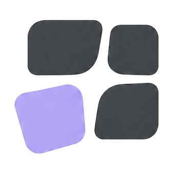

<p align="center">
  
</p>

<h1 align="center">Fleck</h1>

<p align="center">A native, local-first macOS notes workspace for quick capture, focused editing, on-device dictation, and explicitly granted local agent access.</p>

<p align="center">
  <a href="#requirements"></a>
  <a href="Package.swift"></a>
  <a href="https://github.com/exterminatorrat/Fleck/actions/workflows/ci.yml?query=branch%3Amain"></a>
  <a href="LICENSE"></a>
  <a href="docs/RELEASES.md"></a>
</p>

<p align="center">
  <a href="#download-and-launch-fleck">Download &amp; launch</a> ·
  <a href="#what-is-here">Features</a> ·
  <a href="#build-and-test">Build &amp; test</a> ·
  <a href="ARCHITECTURE.md">Architecture</a> ·
  <a href="TESTING.md">Testing</a> ·
  <a href="#contributing">Contributing</a> ·
  <a href="SECURITY.md">Security</a>
</p>

## Download and launch Fleck

> **No public app download yet.** Fleck is currently a source preview. There is
> no published app ZIP or GitHub Release to download and launch. GitHub's
> **Code → Download ZIP** downloads source code, not an installable Mac app.

Check [GitHub Releases](https://github.com/exterminatorrat/fleck/releases) for
published app builds. Until the first binary release is published there, no
public "newest build" is available. Local development candidates and GitHub
Actions artifacts are not supported public releases.

### Installing a future app release

**These steps apply only after an app ZIP is published on GitHub Releases.**

1. Open [GitHub Releases](https://github.com/exterminatorrat/fleck/releases) and
   choose the newest published app release. Read its supported macOS versions,
   Mac architecture, known limitations, and upgrade notes. A **Pre-release**
   label means it is a preview, not a stable release.
2. Under that release's **Assets**, download the **Fleck app ZIP** for your Mac
   and its checksum file. Do **not** choose **Source code (zip)** or
   **Source code (tar.gz)**; neither contains a ready-to-run app. Verify the
   ZIP against the release's SHA-256 checksum before opening it.
3. Double-click the ZIP in Finder to extract it, then drag
   `Fleck <version> Build <number>.app` into **Applications**, keeping its
   versioned name.
4. Open **Applications** and double-click that Fleck app. Follow the release's
   first-launch instructions. If macOS blocks it, check the release's signing
   and notarization notes rather than disabling Gatekeeper or removing
   quarantine protection.
5. Look for **Fleck in the macOS menu bar** and click its icon to open the
   workspace. Fleck is a menu-bar app, so do not rely on a Dock icon to find it.

A prebuilt app does not require Xcode, Swift, or Terminal build commands.
For the current source-only preview, developers can instead
[get the source](#get-the-source) and [build and test](#build-and-test).
Packaged development apps require the maintainer's private build registry;
those commands are not an end-user installer.

Fleck is under active development. [`VERSION`](VERSION) is the source-version
authority; beta storage formats and contributor-facing interfaces may change.
See the
[release policy and binary-distribution checklist](docs/RELEASES.md) for the
remaining release gates.

## What is here

The ordinary build contains:

| Area | Current implementation |
| --- | --- |
| Native workspace | Menu-bar workspace and an independently sized pinned window. |
| Notes and organization | Local notes, tabs, folders, search, backlinks, 30-day Trash, recovery, text/Markdown import, and plain-text/Markdown/RTF export. |
| File shortcuts | A native single-file chooser adds local file references; compact rows can open, reveal, relink, or remove them. Shortcuts stay on this Mac and are not included in note exports. |
| Native editor | An AppKit `NSTextView` editor with native undo, formatting, lists, checklists, and inline display of image files pasted or dropped from Finder. |
| On-device dictation | Apple on-device speech recognition, optional faithful local cleanup, and Inbox-safe Smart Capture routing. |
| Agent Connector | A separately packaged local helper with profile-scoped capabilities, explicit note or folder grants, visible activity, revision checks, and Undo. |
| Local persistence | Readable local storage with atomic replacement and a previous-generation recovery snapshot. |

Inline image import accepts image **file URLs**, such as files copied or dragged
from Finder; it does not import raw PNG or TIFF bitmap clipboard payloads.
Fleck copies valid images of up to 100 MiB and 100 million pixels into its local
image library, keeps the imported original bytes across editor undo and redo,
and automatically fits the displayed image proportionally to the available
editor width with a 320-point height cap. Notes, RTF state, exports, and agent
text retain absolute local-file Markdown references, so image content is not a
portable or self-contained export.

On macOS 26, Fleck can use Apple's on-device Foundation Models when the system
reports them available. Failure or ambiguity falls back to the original text or
Inbox rather than inventing a destination.

The Enhanced Local dependency graph is different. It is opt-in, debug-only
experimental work behind `FLECK_ENHANCED_CANDIDATE=1`, with candidate Parakeet
speech and Gemma cleanup/routing paths. It is not part of the ordinary release
graph and is not approved for distribution.

See [Implementation status](IMPLEMENTATION_STATUS.md) for the short current
roadmap and [Architecture](ARCHITECTURE.md) for the system boundaries.

## Requirements

These are **source-development requirements**. For a future prebuilt app, use
the macOS and architecture requirements listed on its release page instead.

| Requirement | Version or scope |
| --- | --- |
| macOS | 14 as the declared minimum deployment target. |
| Xcode | 26 or later, with the full macOS 26 SDK selected. |
| Swift | 6. |

The deployment target is not a completed compatibility matrix. Current local
validation is on Apple silicon; native Intel compatibility and a full macOS 14
native pass have not been verified. Source tests and offscreen component
captures do not establish live-app or VoiceOver behavior; native checks for
import-menu visibility and untruncated labels remain open.

The standalone Command Line Tools are not enough for this source tree. Check the
active toolchain without building:

```sh
xcodebuild -version
xcrun --sdk macosx --show-sdk-version
swift --version
```

## Get the source

Fork the repository on GitHub, then clone your fork:

```sh
git clone https://github.com/YOUR-USER/fleck.git
cd fleck
git remote add upstream https://github.com/exterminatorrat/fleck.git
```

If you only want to inspect or test the canonical source, clone the upstream URL
directly instead.

## Build and test

Run the ordinary Swift package tests from the repository root:

```sh
unset FLECK_ENHANCED_CANDIDATE
Scripts/run-nonempty-swift-tests.sh '^.+$'
```

The test runner does not launch the product `Fleck.app`, but its synthetic
AppKit host may create fixture windows and change focus. Run native fixtures in
a disposable macOS test account or session with synthetic content.

Maintainer handoff packaging requires a clean committed source tree and the
project's private accepted-build registry. It builds the development-signed app
bundle without launching it:

```sh
mkdir -p .build
RESULT_DIR="$(mktemp -d "$PWD/.build/development-result.XXXXXX")"
RESULT_FILE="$RESULT_DIR/build-result.json"
Scripts/build-fleck-app.sh --result-file "$RESULT_FILE"
FLECK_APP="$(Scripts/fleck-build-identity.py read-result \
  --repo "$PWD" \
  --result-file "$RESULT_FILE" \
  --flavor development)"
printf 'Built %s\n' "$FLECK_APP"
```

Interactive native testing is a separate, explicit step:

```sh
/usr/bin/open -n "$FLECK_APP"
```

Every packaging invocation allocates an immutable
`Fleck <version> Build <number>` app name. A requested result file appears only
after the app is published and verified, so consumers use that exact path
instead of guessing a newest artifact or replacing an earlier build.
Hosted CI uses the explicit `ci-unverified` mode for non-handoff packaging;
contributors without the private registry must not bypass the local checks or
describe a CI artifact as accepted.

Opening Fleck creates local Application Support data and may request macOS
permissions. Use a disposable macOS test account and synthetic fixtures, never
personal notes or recordings. The full commands and manual checks are in
[Testing](TESTING.md).

## Repository map

| Path | Responsibility |
| --- | --- |
| `Sources/FleckCore/` | Local models, mutations, persistence, and recovery. |
| `Sources/FleckAgentProtocol/` | Typed local IPC protocol and framing. |
| `Sources/FleckApp/` | Native macOS UI, editor, dictation, and IPC service. |
| `Sources/FleckAgentBridge/` | MCP/CLI helper and Unix-socket client. |
| `Sources/FleckModelEvaluation/` | Deterministic local-model evaluation support. |
| `Sources/FleckCaptureLab/` | Developer capture tooling. |
| `Tests/` | Swift tests and privacy-safe fixtures. |
| `Scripts/` | Build, validation, audit, and profiling entry points. |
| `Packages/` | Enhanced candidate dependency package. |

## Project principles

Fleck keeps the frequent path small and native. Prefer Apple frameworks and the
standard text system over embedded web views or replacement controls; avoid
background services and dependencies without a demonstrated need; keep notes
local by default; and preserve keyboard access, VoiceOver semantics, Reduce
Motion, contrast, and resource efficiency as features evolve.

## Contributing

Public issues and pull requests are open for ordinary bugs, feature proposals,
and focused contributions. Start with [Contributing](CONTRIBUTING.md),
[Testing](TESTING.md), and the [Code of Conduct](CODE_OF_CONDUCT.md).

Keep sensitive reports out of public issues and pull requests. Security
vulnerabilities use the private route in [Security](SECURITY.md); conduct
reports go privately to [Harry](mailto:harrythemen@outlook.com). The owner
confirmed that a conduct test email and a private security-report notification
were visible to their intended recipients. Those delivery checks do not promise
a response or resolution timeline.

## License and name

Fleck-owned source and documentation in the current tree are licensed under the
[Mozilla Public License 2.0](LICENSE), subject to the boundaries in
[NOTICE](NOTICE), [Branding](BRANDING.md), and
[Third-party notices](THIRD_PARTY_NOTICES.md). Earlier revisions remain subject
to the license notices and terms accompanying those revisions. No contributor
license agreement is required. The Fleck name, logo, and other brand assets are
reserved separately; the source license does not grant trademark rights.

Reviewed ordinary Swift code dependencies use MIT and/or Apache-2.0 terms;
documentation and candidate assets may carry additional terms. Exact pins and
attributions are recorded in the package lockfiles and
[`ThirdPartyNotices.md`](Sources/FleckApp/Resources/ThirdPartyNotices.md).
