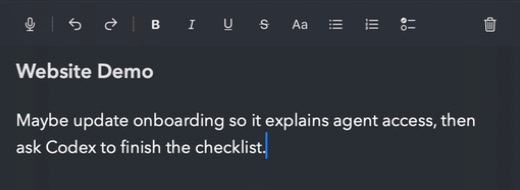

<p align="center">
  
</p>

<h1 align="center">Fleck</h1>

<p align="center">A native, local-first macOS menu-bar notes workspace with on-device dictation and explicit per-note agent collaboration.</p>

<p align="center">
  <a href="https://developer.apple.com/macos/"></a>
  <a href="Package.swift"></a>
  <a href="https://github.com/exterminatorrat/Fleck/actions/workflows/ci.yml"></a>
  <a href="LICENSE"></a>
</p>

## Project status

Fleck is under active development. The repository contains implemented local
development paths for native notes, dictation, persistence, and the local Agent
Connector. The MCP Capability Foundation Phase A is implemented for profile-
scoped access to explicitly granted notes. Build and test the packaged
development app for macOS-specific behavior; the ordinary SwiftPM executable
is not a substitute for that evidence.

Distribution signing and notarization, StoreKit access, and Mac App Store release
remain pending. Enhanced Local is a release-disabled candidate, not a shipping
feature. See [IMPLEMENTATION_STATUS.md](IMPLEMENTATION_STATUS.md) and
[TESTING.md](TESTING.md) for the current boundaries.

## Implemented capabilities

| Area | Current implementation |
| --- | --- |
| Native notes | Menu-bar and pinned-window surfaces; tabs, pinning, live reordering, import/export, 30-day Trash, and recovery. |
| Native editor | A real AppKit `NSTextView` editor with Markdown-compatible bodies, optional RTF sidecars, undo/redo, inline bold/italic/underline/strikethrough, installed fonts and sizes, colors and highlights, bullets, numbering, and checklists. |
| Dictation | Standard on-device speech with no cloud fallback, optional local cleanup, title-only Smart Capture routing, local 30-day history, and a persistent dictation capsule. |
| Agent workspace | Profile-scoped `notes.list`, `notes.read`, `notes.write`, and `changes.undo` capabilities; explicit note/folder grants; a local MCP/CLI helper; optimistic revisions; caller-owned operation IDs; visible activity; and safe Undo. |
| Persistence and privacy | Readable local files, debounced atomic saves, a previous-generation recovery snapshot, Keychain credentials, and same-user Unix-socket IPC. |
| Native product shell | First-launch onboarding, customization, panel-local shortcuts, launch-at-login integration in the packaged app, and an independently sized pinned window. |



## Architecture

Fleck is a native SwiftPM project split into four primary modules. The detailed
design and boundaries live in [ARCHITECTURE.md](ARCHITECTURE.md).

| Module | Responsibility |
| --- | --- |
| `FleckCore` | Portable note models, workspace mutations, preferences, persistence, recovery, transfer formats, dictation history, and activity. |
| `FleckAgentProtocol` | Versioned typed messages and wire framing for the local agent boundary. |
| `FleckApp` | Native macOS scenes, menu-bar and pinned-window UI, editor, dictation runtime, onboarding, settings, and the IPC service. |
| `FleckAgentBridge` | Separately packaged MCP/CLI helper and same-user Unix-socket client. |

The local agent path is deliberately narrow:

```text
local MCP client or CLI
  -> fleck-agent (stdio/CLI; credential in Keychain)
  -> private AF_UNIX socket with same-user peer checks
  -> explicit-share filter -> typed mutation
  -> atomic LocalStore commit -> activity and retry records
```

## Privacy and security

- Notes are stored locally as readable Markdown bodies, optional RTF sidecars,
  JSON workspace/preferences data, and a previous-generation recovery snapshot.
  Saves use atomic replacement and the local store serializes reads, writes, and
  cleanup.
- Standard speech uses Apple's on-device recognition when available and has no
  cloud fallback. Microphone buffers and transcripts are not written as audio.
  Optional cleanup, routing, notes, and history remain local; the Enhanced
  candidate's explicit model download path is separate from ordinary notes.
- Smart Capture receives candidate note identifiers and titles only. Note bodies
  and other note content are excluded from routing prompts; low-confidence or
  unavailable routing falls back to Inbox.
- Agent access is off until an authorized profile has an explicit note grant or
  an explicit `folderIncludingFutureNotes` grant. New profiles start with no
  tools or scopes, and future-note inheritance is off unless the user confirms
  it. Credentials use the Keychain, and the helper communicates with Fleck over
  a private same-user Unix socket. There is no HTTP/TCP listener, cloud bridge,
  or internet-facing port.
- Folder-contained notes use the same existing list/read/write/task/activity/
  Undo operations as unfiled notes when the profile's grant authorizes them;
  there is no separate folder-access path.
- The ordinary notes path has no accounts, analytics, advertising, or mandatory
  network dependency. This is a cooperative local-client boundary and does not
  claim to protect against malicious software already running as the same user.

## Repository layout

```text
Sources/
├── FleckCore/          # Models, persistence, mutations, and activity
├── FleckAgentProtocol/ # Typed local IPC messages and framing
├── FleckApp/           # Native macOS app, editor, dictation, and UI
└── FleckAgentBridge/   # Separate MCP/CLI helper and socket client
Tests/
├── FleckCoreTests/
├── FleckAgentProtocolTests/
├── FleckAppTests/
└── FleckAgentBridgeTests/
Scripts/                # Build, validation, release, and boundary checks
Packages/               # Enhanced Local candidate dependency package
docs/                   # Project and implementation documentation
website/                # Vite website and its tests
```

## Build and test

The deployment/runtime minimum is macOS 14. The current source requires Xcode 26
or later with the macOS 26 SDK or later, and the package uses Swift tools version
6.0. From the repository root, run the ordinary graph with automatic resolution
disabled:

```sh
swift test --disable-automatic-resolution --no-parallel
```

The full macOS validation gate is:

```sh
Scripts/validate-macos.sh
```

Enhanced Local checks use a separate candidate dependency graph and scratch path;
they are not part of ordinary validation or release approval:

```sh
Scripts/resolve-enhanced-candidate.sh .build-candidate \
  swift test --disable-automatic-resolution --no-parallel \
    --scratch-path .build-candidate
```

See [TESTING.md](TESTING.md) for the complete candidate, privacy, accessibility,
resource, signing, and distribution gates.

## Packaged development app

Build and launch the packaged app when testing native macOS behavior:

```sh
Scripts/build-fleck-app.sh
/usr/bin/open -n .build/Fleck.app
```

`swift run Fleck` launches a bare executable without the app-bundle privacy
identity. It is not valid evidence for interactive dictation, Input Monitoring,
signing, or native UI behavior. The packaged app is also the development path for
the embedded Agent Connector.

## Agent connector development

The separately packaged `fleck-agent` helper provides the direct JSON CLI and MCP
surface for explicitly granted notes. Create a profile in **Settings → Agents**,
then grant access to notes or folders and use the profile UUID in a client
configuration. Each profile is independently filtered: `tools/list` is recomputed
on every request, exposes only authorized tools from the static set of exactly
13 existing registrations, and does not advertise `listChanged`.

```sh
codex mcp add fleck -- "/absolute/path/to/fleck" mcp --profile PROFILE_UUID
```

The trust boundary, supported operations, revision/idempotency rules, and client
setup forms are documented in [ARCHITECTURE.md](ARCHITECTURE.md#agent-workspace-trust-and-data-flow)
and [TESTING.md](TESTING.md#agent-workspace-release-gates).

## MCP Capability Foundation Phase A

- Capability authority is native and enforced for every command, with a revision
  recheck before protected reads return and before writes commit.
- A profile may have `notes.list`, `notes.read`, `notes.write`, and
  `changes.undo`. Direct note grants are explicit. A
  `folderIncludingFutureNotes` grant is also explicit, requires confirmation,
  and is off by default; current-note visibility materializes direct grants.
- Legacy per-note sharing is migrated into direct grants for active profiles.
  Legacy shares with no active profile remain unassigned until explicitly
  assigned; a new profile does not inherit them automatically.
- Unknown, private, and unauthorized targets remain indistinguishable. Capability
  storage is recoverable, and capability-load failure is isolated from note
  availability without exposing capability-file contents or paths.
- The wire remains v1-compatible; internal v2 `getCapabilities` discovery is not
  a user-facing CLI command. The MCP surface is tools-only and profile-filtered.
- Pending restored notes stay excluded from agent authority until durable
  workspace commit. If Trash cleanup fails after commit, the workspace remains
  committed and the cleanup error is recoverable rather than rolling back the
  note.

Expanded Discovery/context tools, Organization, Change Sets/Proposals,
Collaboration/Work Items, the Add-on SDK and registry, the sandboxed execution
broker, Context Packs, recipes, schedules, richer automation, a community
directory or marketplace, iCloud, onboarding changes, and AI/dictation changes
are not implemented in Phase A.

## Website development

From the repository root:

```sh
cd website
npm test
npm run build
npm run dev
```

## Enhanced Local candidate

Enhanced Local is release-disabled and non-shippable until every gate in
[TESTING.md](TESTING.md) has evidence. The candidate is isolated behind its own
dependency and model paths; a green build or CI run does not approve its quality,
privacy, resource, legal, accessibility, signing, or store readiness.

## Known limitations

- Distribution signing and notarization are pending.
- Mac App Store release is pending.
- StoreKit access is deliberately unavailable; no purchase or entitlement path is
  presented here.
- Enhanced Local remains a candidate awaiting real-device quality and release-gate
  evidence.
- Manual device, accessibility, performance, lifecycle, client-compatibility, and
  remaining interaction checks are not automated successes.
- Configurable show/hide shortcuts are currently panel-local; system-wide
  activation remains release work.
- The expanded MCP capability roadmap remains deferred: Discovery/context,
  Organization, Change Sets/Proposals, Collaboration/Work Items, add-ons,
  registry/marketplace, and the sandbox broker are not available.

## Reporting issues

Reproducible bug reports and product feedback are welcome. Please include the
commit, macOS/Xcode/Swift versions, reproduction steps, and whether the packaged
app or ordinary SwiftPM path was used. See [CONTRIBUTING.md](CONTRIBUTING.md) for
the maintainer workflow. External code contributions and pull requests are not
currently accepted.

## License

Fleck is source-available under the [PolyForm Shield License 1.0.0](LICENSE), with
Harry Jin as licensor and copyright holder. Its noncompete condition protects Fleck
and official products from competing source or binary distributions; the operative
terms are only in `LICENSE`.

Phase A makes no license change.

See [NOTICE](NOTICE) for the required copyright and brand notice, and
[Sources/FleckApp/Resources/ThirdPartyNotices.md](Sources/FleckApp/Resources/ThirdPartyNotices.md)
for third-party software notices. Dependencies retain their own license terms.
