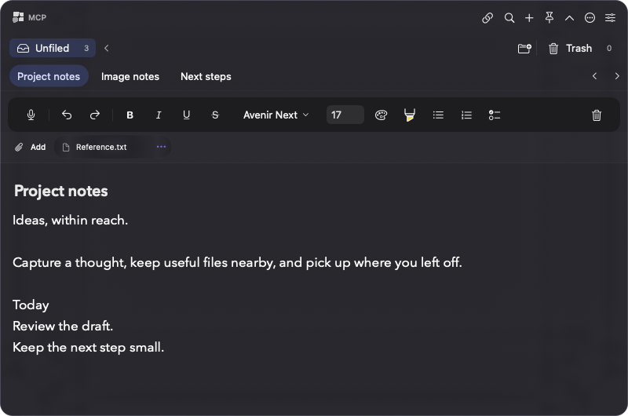
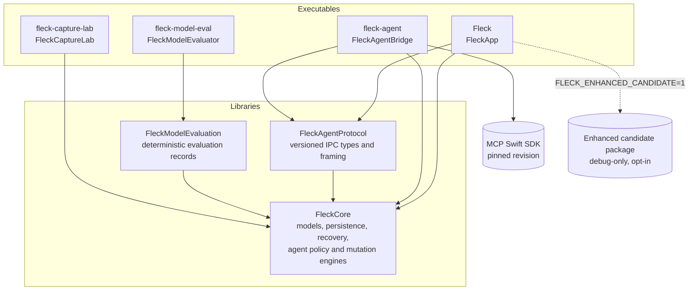
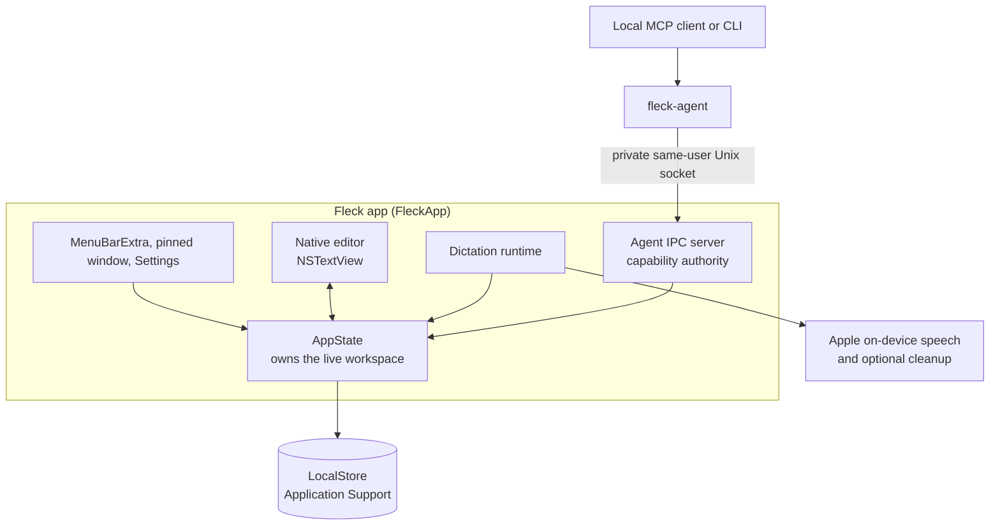
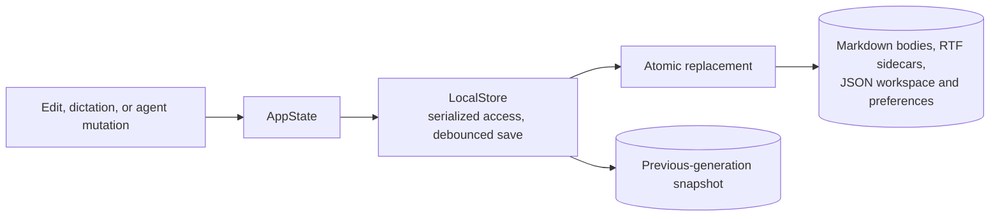
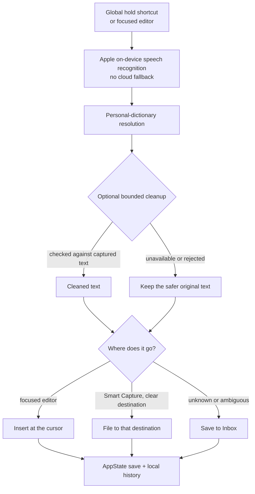
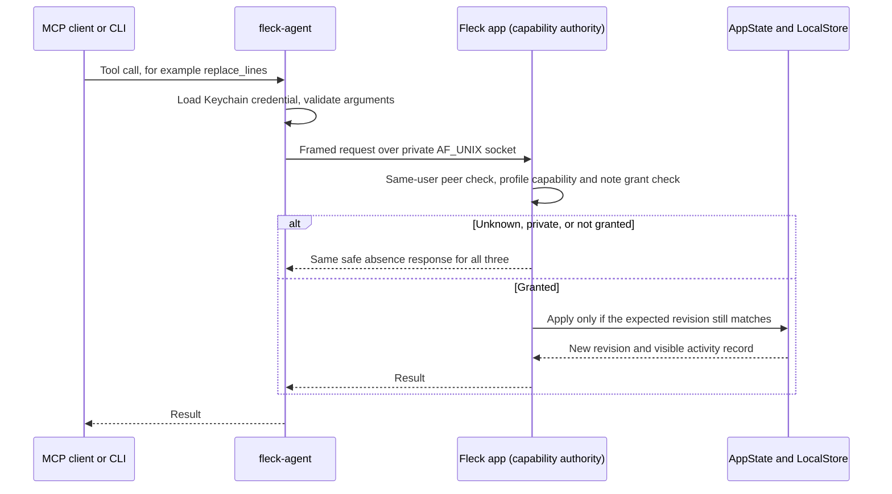

<h1 align="center">
  <picture>
    <source media="(prefers-color-scheme: dark)" srcset="Assets/Brand/fleck-lockup-white.png">
    
  </picture>
</h1>

<p align="center">A native, local-first macOS notes workspace for quick capture, focused editing, on-device dictation, and explicitly granted local agent access.</p>

<p align="center">
  <a href="#requirements"></a>
  <a href="Package.swift"></a>
  <a href="https://github.com/exterminatorrat/Fleck/actions/workflows/ci.yml?query=branch%3Amain"></a>
  <a href="LICENSE"></a>
  <a href="docs/RELEASES.md"></a>
</p>

<p align="center">
  <a href="#download-and-launch-fleck">Download &amp; launch</a> ·
  <a href="docs/release-notes/1.1.2-beta.2.md">Release notes &amp; onboarding</a> ·
  <a href="#what-is-here">Features</a> ·
  <a href="#how-it-works">How it works</a> ·
  <a href="#architecture">Architecture</a> ·
  <a href="#build-and-test">Build &amp; test</a> ·
  <a href="TESTING.md">Testing</a> ·
  <a href="#contributing">Contributing</a> ·
  <a href="SECURITY.md">Security</a>
</p>

---

Fleck lives in your menu bar. Click it to jot a note, hold a shortcut to dictate, or let a local AI tool you have explicitly authorized read and edit the specific notes you chose. Notes are readable files on your Mac, speech recognition runs on-device, and the ordinary app needs no account, cloud service, model download, or browser runtime.

| | |
| --- | --- |
| **Status** | Public Developer Preview: `1.1.2-beta.2` on [GitHub Releases](https://github.com/exterminatorrat/Fleck/releases), published as a **Pre-release** |
| **Platform** | macOS 14 declared minimum; validated on Apple silicon (native Intel and a full macOS 14 pass are not yet verified) |
| **Stack** | Swift 6, SwiftUI shell, AppKit `NSTextView` editor, Apple on-device speech, [MCP Swift SDK](https://github.com/modelcontextprotocol/swift-sdk) for the agent bridge |
| **Storage** | Readable Markdown notes, optional RTF sidecars, and JSON settings in Application Support; atomic writes plus a recovery snapshot |
| **Network** | No account, cloud service, or model download for ordinary use. Agent access uses a private same-user Unix socket: no HTTP listener, cloud relay, or internet-facing port |
| **License** | [MPL-2.0](LICENSE), with the boundaries in [NOTICE](NOTICE) and [Branding](BRANDING.md) |

## Download and launch Fleck

> **First public Developer Preview available.** Fleck `1.1.2-beta.2` is published on
> [GitHub Releases](https://github.com/exterminatorrat/Fleck/releases) as a **Pre-release**
> Developer Preview. Read the [release notes and first-launch onboarding](docs/release-notes/1.1.2-beta.2.md)
> before your first run — in-app onboarding is not packaged in this release, and the
> release notes teach the workspace, formatting, dictation, and agent setup in a few
> minutes. Local development candidates and GitHub Actions artifacts remain unsupported
> public installs.

### Installing the app release

**These steps use the published app ZIP on GitHub Releases — not the source code.**

1. Open [GitHub Releases](https://github.com/exterminatorrat/fleck/releases) and
   choose `1.1.2-beta.2` (or the newest preview). Every published build is a **Pre-release**
   Developer Preview until the first official release, and each preview is honest about
   its limitations.
2. Under that release's **Assets**, download the **Fleck app ZIP** for your Mac
   and its checksum file. Do **not** choose **Source code (zip)** or
   **Source code (tar.gz)**; neither contains a ready-to-run app. Verify the
   ZIP against the release's SHA-256 checksum before opening it.
3. Double-click the ZIP in Finder to extract it, then drag
   `Fleck <version> Build <number>.app` into **Applications**, keeping its
   versioned name.
4. Open **Applications** and double-click that Fleck app. Follow the release's
   first-launch instructions. If macOS blocks it, check the release's signing
   and notarization notes rather than disabling Gatekeeper or removing
   quarantine protection.
5. Look for **Fleck in the macOS menu bar** and click its icon to open the
   workspace. Fleck is a menu-bar app, so do not rely on a Dock icon to find it.

A prebuilt app does not require Xcode, Swift, or Terminal build commands.
Developers who want the newest source can instead
[get the source](#get-the-source) and [build and test](#build-and-test).
Packaged development apps require the maintainer's private build registry;
those commands are not an end-user installer.

Fleck is under active development. [`VERSION`](VERSION) is the source-version
authority; storage formats and contributor-facing interfaces may still change.
See the [release policy and binary-distribution checklist](docs/RELEASES.md)
for the current release gates.

## What is here



Illustration from a development build with synthetic notes and a synthetic file shortcut.
Release-candidate screenshots from the accepted build replace this image before launch
materials are finalized.

The ordinary build contains:

| Area | Current implementation |
| --- | --- |
| Native workspace | Menu-bar workspace and an independently sized pinned window. |
| Notes and organization | Local notes, tabs, folders, search, backlinks, 30-day Trash, recovery, text/Markdown import, and plain-text/Markdown/RTF export. |
| File shortcuts | A native single-file chooser adds local file references; compact rows can open, reveal, relink, or remove them. Shortcuts stay on this Mac and are not included in note exports. |
| Native editor | An AppKit `NSTextView` editor with native undo, formatting, lists, checklists, and inline display of image files pasted or dropped from Finder. |
| On-device dictation | Apple on-device speech recognition, optional faithful local cleanup, and Inbox-safe Smart Capture routing. |
| Agent Connector | A separately packaged local helper with profile-scoped capabilities, explicit note or folder grants, visible activity, revision checks, and Undo. |
| Local persistence | Readable local storage with atomic replacement and a previous-generation recovery snapshot. |

Inline image import accepts image **file URLs**, such as files copied or dragged
from Finder; it does not import raw PNG or TIFF bitmap clipboard payloads.
Fleck copies valid images of up to 100 MiB and 100 million pixels into its local
image library, keeps the imported original bytes across editor undo and redo,
and automatically fits the displayed image proportionally to the available
editor width with a 320-point height cap. Notes, RTF state, exports, and agent
text retain absolute local-file Markdown references, so image content is not a
portable or self-contained export.

On macOS 26, Fleck can use Apple's on-device Foundation Models when the system
reports them available. Failure or ambiguity falls back to the original text or
Inbox rather than inventing a destination.

The Enhanced Local dependency graph is different. It is opt-in, debug-only
experimental work behind `FLECK_ENHANCED_CANDIDATE=1`, with candidate Parakeet
speech and Gemma cleanup/routing paths. It is not part of the ordinary release
graph and is not approved for distribution.

See [Implementation status](IMPLEMENTATION_STATUS.md) for the short current
roadmap and [Architecture](ARCHITECTURE.md) for the system boundaries.

## How it works

Fleck has three everyday flows. Each one ends in the same place: a single state owner (`AppState`) that applies the change and saves it.

1. **Write.** Click the menu-bar icon (or open the pinned window) and type. The editor is a real macOS text view, so selection, input methods, spelling, undo, and VoiceOver behave the way they do everywhere else on your Mac. Edits go to `AppState`, which hands them to `LocalStore` to save.
2. **Dictate.** Hold the global shortcut and speak. Apple's on-device recognizer transcribes, your personal dictionary corrects known terms, and an optional cleanup pass tidies the text only if it stays faithful to what you said. The result is inserted where you are, or filed by Smart Capture. If Fleck is unsure where it belongs, it goes to your Inbox.
3. **Connect an agent (optional, off by default).** Create a profile, grant it capabilities, and share specific notes or an explicitly confirmed folder. A local MCP client talks to the `fleck-agent` helper, which talks to the app over a private socket. Every write names the revision it expects, so it cannot silently overwrite newer work, and every change shows up in an activity list with Undo.

## Architecture

Fleck is one Swift package with a deliberate dependency direction: portable note state at the bottom, macOS presentation on top, and every optional integration behind an explicit boundary. Nothing optional can quietly widen what the app is allowed to do.

### Package structure


```mermaid
flowchart TB
  subgraph exes["Executables"]
    App["Fleck<br/>FleckApp"]
    Bridge["fleck-agent<br/>FleckAgentBridge"]
    Eval["fleck-model-eval<br/>FleckModelEvaluator"]
    Lab["fleck-capture-lab<br/>FleckCaptureLab"]
  end

  subgraph libs["Libraries"]
    Protocol["FleckAgentProtocol<br/>versioned IPC types and framing"]
    Evaluation["FleckModelEvaluation<br/>deterministic evaluation records"]
    Core["FleckCore<br/>models, persistence, recovery,<br/>agent policy and mutation engines"]
  end

  MCP[("MCP Swift SDK<br/>pinned revision")]
  Enhanced[("Enhanced candidate package<br/>debug-only, opt-in")]

  App --> Core
  App --> Protocol
  Bridge --> Core
  Bridge --> Protocol
  Bridge --> MCP
  Protocol --> Core
  Evaluation --> Core
  Eval --> Evaluation
  Lab --> Core
  App -. "FLECK_ENHANCED_CANDIDATE=1" .-> Enhanced
```

`FleckCore` has no UI dependency, and `FleckAgentProtocol` depends only on core value types. The app and the bridge never import each other: they meet across the protocol.

| Target | Responsibility |
| --- | --- |
| `FleckCore` | Note and workspace models, mutations, Markdown operations, search and backlinks, preferences, persistence and recovery, import/export, personal dictionary, dictation history, and agent policy, mutation, undo, and activity engines. |
| `FleckAgentProtocol` | Versioned request and response types, endpoint conventions, and framed local IPC. |
| `FleckApp` | macOS lifecycle, menu-bar and pinned-window scenes, AppKit editor, onboarding, settings, dictation, and the in-app agent service. |
| `FleckAgentBridge` | The separately packaged `fleck-agent` MCP/CLI process: Keychain credential lookup, argument validation, and the Unix-socket client. |
| `FleckModelEvaluation` / `FleckModelEvaluator` | Deterministic evaluation records and a command-line evaluator (`fleck-model-eval`) for local-model candidates. |
| `FleckCaptureLab` | Developer tooling (`fleck-capture-lab`) for controlled visual capture. Not part of the core note path. |

### Runtime composition


```mermaid
flowchart TB
  subgraph shell["Fleck app (FleckApp)"]
    Scenes["MenuBarExtra, pinned window, Settings"]
    State["AppState<br/>owns the live workspace"]
    Editor["Native editor<br/>NSTextView"]
    Dict["Dictation runtime"]
    IPC["Agent IPC server<br/>capability authority"]
  end

  Store[("LocalStore<br/>Application Support")]
  Speech["Apple on-device speech<br/>and optional cleanup"]
  Client["Local MCP client or CLI"]
  Bridge["fleck-agent"]

  Scenes --> State
  Editor <--> State
  Dict --> State
  IPC --> State
  State --> Store
  Dict --> Speech
  Client --> Bridge
  Bridge -- "private same-user Unix socket" --> IPC
```

`AppState` is the single owner of the live workspace. It coordinates saves, recovery, Trash, import/export, search, file references, and agent mutations, so every change, whether it came from you, from dictation, or from an agent, follows the same path and is visible the same way. SwiftUI presents the shell; the editor wraps a real `NSTextView` so the macOS text system keeps doing the hard parts.

### Storage and recovery


```mermaid
flowchart LR
  Change["Edit, dictation, or agent mutation"] --> State["AppState"]
  State --> Store["LocalStore<br/>serialized access, debounced save"]
  Store --> Atomic["Atomic replacement"]
  Atomic --> Files[("Markdown bodies, RTF sidecars,<br/>JSON workspace and preferences")]
  Store --> Snap[("Previous-generation snapshot")]
```

Fleck stores readable Markdown note bodies, optional RTF sidecars, and JSON workspace and preference data under your Application Support directory. `LocalStore` serializes access, debounces ordinary saves, writes with atomic replacement, and keeps a previous-generation snapshot for recovery. This makes the data inspectable and crash-tolerant. **It is not encryption**: software already running as your macOS user can operate within your user's authority. Agent Connector secrets belong in Keychain, never in note files or preferences.

### Dictation pipeline


```mermaid
flowchart TB
  Trigger["Global hold shortcut<br/>or focused editor"] --> Speech["Apple on-device speech recognition<br/>no cloud fallback"]
  Speech --> Dictionary["Personal-dictionary resolution"]
  Dictionary --> Cleanup{"Optional bounded cleanup"}
  Cleanup -- "checked against captured text" --> Clean["Cleaned text"]
  Cleanup -- "unavailable or rejected" --> Raw["Keep the safer original text"]
  Clean --> Route{"Where does it go?"}
  Raw --> Route
  Route -- "focused editor" --> Insert["Insert at the cursor"]
  Route -- "Smart Capture, clear destination" --> Dest["File to that destination"]
  Route -- "unknown or ambiguous" --> Inbox["Save to Inbox"]
  Insert --> Save["AppState save + local history"]
  Dest --> Save
  Inbox --> Save
```

- Standard speech requires Apple's on-device recognition and **has no cloud fallback**.
- On macOS 26, the ordinary build can use the system Foundation Models for cleanup and routing when the system reports them available. Cleanup is checked against the captured text; unavailable or rejected cleanup keeps the safer text.
- Audio buffers are transient. Dictation history stores text and outcome metadata, **not recorded audio**.
- Test and diagnostic evidence must use synthetic content and be sanitized before it leaves the test machine.

### Agent Connector

The connector is **off until you create a profile and grant capabilities**. A profile can receive four capabilities, plus explicit note grants or an explicitly confirmed folder grant that may include future notes in that folder.


```mermaid
sequenceDiagram
  participant Client as MCP client or CLI
  participant Bridge as fleck-agent
  participant App as Fleck app (capability authority)
  participant Store as AppState and LocalStore

  Client->>Bridge: Tool call, for example replace_lines
  Bridge->>Bridge: Load Keychain credential, validate arguments
  Bridge->>App: Framed request over private AF_UNIX socket
  App->>App: Same-user peer check, profile capability and note grant check
  alt Unknown, private, or not granted
    App-->>Bridge: Same safe absence response for all three
  else Granted
    App->>Store: Apply only if the expected revision still matches
    Store-->>App: New revision and visible activity record
    App-->>Bridge: Result
  end
  Bridge-->>Client: Result
```

The bridge exposes a static registry of **13 MCP tools**. For every request, the list is filtered by the profile's current capabilities, so a client only ever sees tools it is allowed to use.

| Capability | Tools |
| --- | --- |
| `notes.list` | `list_shared_notes` |
| `notes.read` | `read_note`, `list_tasks`, `list_agent_activity` |
| `notes.write` | `append_text`, `insert_text`, `replace_lines`, `delete_lines`, `add_task`, `rename_task`, `set_task_state`, `remove_task` |
| `changes.undo` | `undo_agent_change` |

Safety properties built into the protocol:

- **No blind overwrites.** Every write carries the revision it expects and a caller-owned operation ID, so stale writes do not clobber newer work and a retried write does not duplicate. Line replacement and deletion also carry a SHA-256 of the lines the caller observed.
- **Bounded input.** Text arguments are capped at 65,536 UTF-8 bytes, and tool schemas reject unknown properties.
- **No enumeration.** Unknown, private, and unauthorized targets return the same safe absence response, so error messages cannot be used to discover which notes exist.
- **Visible and reversible.** Activity returns through the same state owner as every other change, and eligible changes can be undone.
- **Local only.** A private `AF_UNIX` socket with same-user peer checks; credentials live in Keychain.

> **Trust boundary.** This is a cooperative local-client boundary. It limits accidental or over-broad access by clients you configured; it cannot defend against malicious software already running as your macOS user.

### Optional Enhanced Local graph

The experimental Enhanced Local paths (candidate Parakeet speech and Gemma cleanup/routing, model manifests, installation state, and resource residency) are isolated at compile time so they cannot silently enter an ordinary release.

| | Ordinary build | With `FLECK_ENHANCED_CANDIDATE=1` |
| --- | --- | --- |
| Extra packages | None beyond the pinned MCP SDK | Adds the candidate dependency package and its reviewed pins |
| Enhanced source files | `EnhancedModelManager.swift` and `EnhancedSpeechCapture.swift` are excluded from the app target | Included, and app resources are processed |
| Compile flags | None | `CLEAN_DICTATION_ENHANCED_CANDIDATE_REQUESTED` always; `CLEAN_DICTATION_ENHANCED_CANDIDATE` in **debug configurations only** |
| Distribution | Release graph | Not approved for distribution; has separate legal, model-integrity, performance, and distribution gates |

### Design principles

- **Native and simple.** AppKit, SwiftUI, Foundation, and the macOS text system before any dependency or replacement control.
- **Local-first.** Ordinary notes and settings live in your Application Support directory; core note use has no server dependency.
- **Truthful persistence.** Mutations become visible through one state owner and are saved with atomic replacement and recovery data.
- **Bounded integration.** Dictation and agent access fail closed or fall back to a safe local result rather than broadening access.
- **Accessible and efficient.** Keyboard use, VoiceOver, Reduce Motion, contrast, idle CPU, memory pressure, and thermal state are architectural inputs, not afterthoughts.

Dependencies stay rare: a new one needs a concrete runtime or maintenance benefit, compatible licensing, a reviewed immutable resolution, and no unnecessary effect on the ordinary app's size, network behavior, or idle resources. The ordinary package pins the Model Context Protocol Swift SDK; its transitive packages are recorded in `Package.resolved`.

## Requirements

These are **source-development requirements**. For the published prebuilt app,
use the macOS and architecture requirements listed on its release page instead
(macOS 14 or later; validated on Apple silicon — native Intel and a full macOS 14
native pass are not yet verified).

| Requirement | Version or scope |
| --- | --- |
| macOS | 14 as the declared minimum deployment target. |
| Xcode | 26 or later, with the full macOS 26 SDK selected. |
| Swift | 6. |

The deployment target is not a completed compatibility matrix. Current local
validation is on Apple silicon; native Intel compatibility and a full macOS 14
native pass have not been verified. Source tests and offscreen component
captures do not establish live-app or VoiceOver behavior.

The standalone Command Line Tools are not enough for this source tree. Check the
active toolchain without building:

```sh
xcodebuild -version
xcrun --sdk macosx --show-sdk-version
swift --version
```

## Get the source

Fork the repository on GitHub, then clone your fork:

```sh
git clone https://github.com/YOUR-USER/fleck.git
cd fleck
git remote add upstream https://github.com/exterminatorrat/fleck.git
```

If you only want to inspect or test the canonical source, clone the upstream URL
directly instead.

## Build and test

Run the ordinary Swift package tests from the repository root:

```sh
unset FLECK_ENHANCED_CANDIDATE
Scripts/run-nonempty-swift-tests.sh '^.+$'
```

The test runner does not launch the product `Fleck.app`, but its synthetic
AppKit host may create fixture windows and change focus. Run native fixtures in
a disposable macOS test account or session with synthetic content.

Pull requests that only add or modify the root `README.md` use lightweight
documentation validation. Changes to any other path, mixed changes, and README
deletions or renames run the full CI pipeline. The required `macOS build and
tests` check runs in both routes; a docs-only pass does not claim that Swift
tests or packaging ran.

Maintainer handoff packaging requires a clean committed source tree and the
project's private accepted-build registry. It builds the development-signed app
bundle without launching it:

```sh
mkdir -p .build
RESULT_DIR="$(mktemp -d "$PWD/.build/development-result.XXXXXX")"
RESULT_FILE="$RESULT_DIR/build-result.json"
Scripts/build-fleck-app.sh --result-file "$RESULT_FILE"
FLECK_APP="$(Scripts/fleck-build-identity.py read-result \
  --repo "$PWD" \
  --result-file "$RESULT_FILE" \
  --flavor development)"
printf 'Built %s\n' "$FLECK_APP"
```

Interactive native testing is a separate, explicit step:

```sh
/usr/bin/open -n "$FLECK_APP"
```

Every packaging invocation allocates an immutable
`Fleck <version> Build <number>` app name. A requested result file appears only
after the app is published and verified, so consumers use that exact path
instead of guessing a newest artifact or replacing an earlier build.
Hosted CI uses the explicit `ci-unverified` mode for non-handoff packaging;
contributors without the private registry must not bypass the local checks or
describe a CI artifact as accepted.

Opening Fleck creates local Application Support data and may request macOS
permissions. Use a disposable macOS test account and synthetic fixtures, never
personal notes or recordings. The full commands and manual checks are in
[Testing](TESTING.md).

## Repository map

| Path | Responsibility |
| --- | --- |
| `Sources/FleckCore/` | Local models, mutations, persistence, recovery, search, backlinks, personal dictionary, and agent policy and mutation engines. |
| `Sources/FleckAgentProtocol/` | Typed local IPC protocol and framing. |
| `Sources/FleckApp/` | Native macOS UI, editor, dictation, onboarding, settings, and the in-app IPC service. |
| `Sources/FleckAgentBridge/` | MCP/CLI helper (`fleck-agent`), tool registry, and Unix-socket client. |
| `Sources/FleckModelEvaluation/` | Deterministic local-model evaluation support. |
| `Sources/FleckCaptureLab/` | Developer capture tooling. |
| `Tests/` | Swift tests and privacy-safe fixtures. |
| `Scripts/` | Build, validation, audit, and profiling entry points. |
| `Packages/` | Enhanced candidate dependency package. |
| `docs/` | Release policy and notes, build identity, design, evaluation, performance, testing, and theme documents. |

## Documentation

| Topic | Reference |
| --- | --- |
| What Fleck is for | [Product](PRODUCT.md) · [Product plan](PRODUCT_PLAN.md) |
| System boundaries | [Architecture](ARCHITECTURE.md) |
| Current roadmap | [Implementation status](IMPLEMENTATION_STATUS.md) |
| Tests and evidence | [Testing](TESTING.md) |
| Releases and distribution | [Release policy](docs/RELEASES.md) · [Build identity](docs/build-identity.md) · [Changelog](CHANGELOG.md) |
| Security reporting | [Security](SECURITY.md) |
| Contributing | [Contributing](CONTRIBUTING.md) · [Code of Conduct](CODE_OF_CONDUCT.md) |
| Name, brand, and licenses | [Branding](BRANDING.md) · [Notice](NOTICE) · [Third-party notices](THIRD_PARTY_NOTICES.md) |

## Project principles

Fleck keeps the frequent path small and native. Prefer Apple frameworks and the
standard text system over embedded web views or replacement controls; avoid
background services and dependencies without a demonstrated need; keep notes
local by default; and preserve keyboard access, VoiceOver semantics, Reduce
Motion, contrast, and resource efficiency as features evolve.

## Contributing

Public issues and pull requests are open for ordinary bugs, feature proposals,
and focused contributions. Start with [Contributing](CONTRIBUTING.md),
[Testing](TESTING.md), and the [Code of Conduct](CODE_OF_CONDUCT.md).

Keep sensitive reports out of public issues and pull requests. Security
vulnerabilities use the private route in [Security](SECURITY.md); conduct
reports go privately to [Harry](mailto:harrythemen@outlook.com). The owner
confirmed that a conduct test email and a private security-report notification
were visible to their intended recipients. Those delivery checks do not promise
a response or resolution timeline.

## License and name

Fleck-owned source and documentation in the current tree are licensed under the
[Mozilla Public License 2.0](LICENSE), subject to the boundaries in
[NOTICE](NOTICE), [Branding](BRANDING.md), and
[Third-party notices](THIRD_PARTY_NOTICES.md). Earlier revisions remain subject
to the license notices and terms accompanying those revisions. No contributor
license agreement is required. The Fleck name, logo, and other brand assets are
reserved separately; the source license does not grant trademark rights.

Reviewed ordinary Swift code dependencies use MIT and/or Apache-2.0 terms;
documentation and candidate assets may carry additional terms. Exact pins and
attributions are recorded in the package lockfiles and
[`ThirdPartyNotices.md`](Sources/FleckApp/Resources/ThirdPartyNotices.md).
