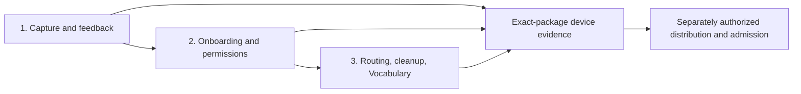

# Fleck Dictation Reliability Program

**Status:** Phase 1 in progress; packets 1A–1D implemented locally with fresh Sol/High `ship`. Packet 1D source is `2fb3a1a`; packets 1E/1F and device acceptance remain open. This document does not authorize Phases 2–3 implementation, model downloads, installation, publication, or release admission.

**Owner:** Central primary orchestrator. Codex-native GPT-5.6 Sol / High implementers for bounded work; fresh Sol / High reviewers. Never Terra.

**Baseline:** `origin/main` at `68b6b429ab4f1f130252d9865a2c616b7224cca7`, refreshed 2026-09-05. A later base must be a verified descendant. Working checkout: `${FLECK_REPO}/.worktrees/central-orchestrator-validation`, branch `codex/central-orchestrator-validation`.

## Outcome

Make dictation trustworthy on the 8 GB M1 MacBook Pro: the shortcut visibly responds, capture preserves the first word, stopping and cancelling work predictably, output retains intended meaning, and the user understands where text went. Use the Mac mini as a separate control. Better Mac mini behavior does not substitute for MacBook acceptance.

## Non-negotiable product boundaries

- Apple Silicon and English are the supported evaluation cohort.
- Parakeet TDT 0.6B v2 is the enhanced dictation candidate.
- Gemma 3 1B IT 4-bit is the provisional cleanup candidate.
- Apple Speech and deterministic faithful cleanup remain safe fallbacks.
- No cloud transcription, transcript upload, hidden network fallback, or bundled model weights.
- Microphone access begins only after an explicit dictation action and granted permission. No always-listening or background audio retention.
- Preserve names, numbers, dates, URLs, paths, commands, commitments, destinations, negation, and technical terms.
- Preserve accepted Settings, Notes, global pill/waveform, unfiled layout, Vocabulary, cancellation, model management, and sorting lineage.
- No changes to `/Applications/Fleck Pre-Astra Corrected Build.app` during source development.
- No push, PR creation/update, merge, GitHub changes, model download, or release claim without explicit authorization.
- A passing source test is not packaged-app or real-microphone proof.

## Evidence behind the program

These are source findings, not reproduced MacBook measurements:

| Symptom | Verified source behavior | Remaining evidence |
| --- | --- | --- |
| Late waveform/missing beginning | EnhancedSpeechCapture loads inference before starting audio; arming uses the idle mark | Physical press, first buffer, first visible feedback, and first-word recall on MacBook |
| Repeated cold starts | At most 15-second Parakeet retention on 8 GB; memory/power can reduce it to 5/0 seconds; Gemma preparation forces Parakeet cold | Actual pressure and model-residency transitions during repeated use |
| Incorrect words survive | Faithful validator disallows general lexical substitution; dictionary runs after recognition | Raw/dictionary/cleaned/saved comparison for exact failed phrases |
| Cleanup absent on slow/long capture | 80-token cleanup ceiling; 3.5-second cleanup deadline starts at stop and includes ASR finalization | Stage timings and explicit fallback reason per trial |
| School/to do routes to Inbox | Generic titles excluded from exact/Foundation routing; candidates omit folder context | Actual note titles/body/duplicates and selected model path |
| Shortcut onboarding fails | Demo precedes permissions; permission request advances without confirming grant | Fresh-account first-run and denied/regranted permission flows |
| Notes vs Inbox confusing | Focused editor inserts directly; otherwise automatic route with Inbox fallback | Novice task completion without coaching |
| Personalization assumed complete | Dictionary context structures exist; production recognizer acknowledgement defaults unsupported | Recognizer-specific support and capability presentation |

## Three phases

### Phase 1 — Capture and feedback

**Goal:** The user can tell immediately that the shortcut was received; recording starts independently of model loading; no audio remains active after stop/cancel; cold starts preserve early speech.

Detailed execution: [Capture and Feedback Implementation Plan](2026-09-05-capture-feedback.md).

Packets, in dependency order:

1. **1A: Distinguishable starting feedback.** Make arming visibly different from idle without claiming microphone readiness or faking a waveform. Preserve short-tap semantics, cancellation, accessibility, docking, and accepted listening design.
2. **1B: Audio-first enhanced startup.** Start bounded capture after permission and model-eligibility checks, before awaiting model load. Define startup ownership and stop/cancel during load before changing code.
3. **1C: Actual recording feedback and gesture lifecycle.** Carry audio-ready state/measurements to the coordinator/pill. A waveform represents live samples, never model readiness. Preserve press/hold/double-tap/pointer behavior and stale-session protection.
4. **1D: Stage timing and recovery evidence.** Expose content-free timing and failure reasons using existing measurement structures. Distinguish event delivery, UI response, audio start, model load, inference, cleanup, routing, and persistence.
5. **1E: Resource-policy evaluation.** Measure the current policy before tuning it. Keep pressure/sleep/power release behavior; do not pin both models permanently or change timers without comparative evidence.
6. **1F: Exact-package acceptance on both Macs.** Fresh candidate artifact, fixed identity, controlled microphone trials, low-memory and sleep/wake cases; record failures honestly.

Phase exit requires all source packet reviews plus MacBook and Mac mini package evidence. A 1A visual improvement alone does not close the first-word defect or Phase 1.

### Phase 2 — Onboarding, permissions, and understandable destinations

**Goal:** A first-time user can enable dictation, successfully use the shortcut, and predict whether output enters the current note or automatic routing.

#### 2A: Permission state and recovery

- Inspect OnboardingCoordinator, OnboardingView, DictationRuntime permission methods, ModifierKeyEventTap, and DictationAvailability.
- Place permission readiness before a shortcut-dependent demo.
- Treat requesting access, having access, and configuring a working event tap as separate states.
- Do not advance an Allow action as if it succeeded when it returned false. Keep an explicit Not Now path, clearly marked incomplete.
- Reuse the Settings recovery action to open the correct system pane; recheck on application activation.
- Handle denial, grant, app restart requirements, revoked access, and failed event-tap creation distinctly.
- Test with isolated preferences and fresh-account/manual macOS evidence. Never reset the owner's global permission database for testing.
- Gate: an uncoached tester can enable Input Monitoring and demonstrate a real key press/release; denied access leaves a clear next action.

#### 2B: Teach both capture modes

- Explain “Dictate here” when a Fleck editor owns the caret and “Choose a note automatically” for global capture.
- Demonstrate the persistent global pill, hold gesture, hands-free gesture, stop, and Escape.
- Do not make users infer behavior from merely selecting a tab or folder.
- Explain Inbox as a safe holding note when no confident destination exists.
- Preserve a visible saved destination and actionable ambiguity choice.
- Gate: novice completes one focused capture and one global capture, then locates each result without guidance.

#### 2C: Recovery discoverability

- Surface microphone missing, shortcut permission missing, unavailable selected model, and cleanup fallback separately.
- Preserve text on model/cleanup/routing failures; clearly indicate saved raw vs unsaved.
- Provide a route to the relevant Settings section rather than an unexplained generic failure.
- Review keyboard navigation, VoiceOver, Reduced Motion, low contrast, and small displays.
- Gate: each failure has a truthful explanation, one useful next step, and no silent data loss.

#### 2D: Returning and migrating users

- Existing-user exemption must not imply working permissions on a new Mac.
- Add a recoverable readiness check without forcing full onboarding on every launch.
- Keep trial/access gating separate from permission troubleshooting.
- Test fresh workspace, existing workspace, imported workspace, interrupted onboarding, and relaunch.

### Phase 3 — Routing, transcription/cleanup quality, and Vocabulary

**Goal:** Faithful text lands in the intended note, or ambiguity is explained and recoverable.

#### 3A: Freeze a local regression corpus

- Capture the actual failed utterance, raw ASR result, dictionary baseline, cleanup result, saved text, intended note, and actual note.
- Include “I need to finish my physics lab” for School/to do; duplicate to-do titles in different folders; unrelated tasks; no destination hint; explicit destination hints; and conflicting hints.
- Add fillers, repeated words, negation, dates, numbers, paths, commands, names, Fleck/flag, technical terms, commitments, and destinations.
- Separate recognition correctness from grammar, formatting, content extraction, and destination correctness.
- Keep transcripts and private note bodies local and outside source control. Use synthetic equivalents in committed tests.
- Gate: every quality claim names its tested cohort and corpus version; no “100% grammar” promise beyond a finite measured corpus.

#### 3B: Folder-aware note retrieval

- Extend routing candidates with bounded folder context and stable IDs; include that context in cache invalidation and ambiguity UI.
- Reconsider generic-title exclusion only with contextual disambiguation, not blanket removal.
- Evaluate both Foundation and Gemma paths using the same intended behaviors; engine availability must not silently remove folder context.
- Preserve duplicate-title safety, bounds, cancellation, stale selection checks, and receipt-bound moves.
- Gate: unique School/to do can resolve with sufficient evidence; duplicate/ambiguous cases offer choices; unrelated text never auto-routes solely because “to do” appears.

#### 3C: Separate routing intent from saved content

- Represent destination selection and content extraction as distinct validated decisions.
- Example target: “In my school to-do list, I need to finish my physics lab” → School/to do, “I need to finish my physics lab.”
- Remove an instruction prefix only when its interpretation is explicit and safe; otherwise preserve text and ask/offer a destination.
- Do not classify incidental references to a note as commands.
- Gate: command-like text intended as literal content remains intact; protected meaning and cancellation remain unchanged.

#### 3D: Safe grammar and recognition correction

- Classify existing validator operations and rejection reasons against corpus failures.
- Distinguish a spelling/ASR substitution from a grammar edit; the latter must not guess an intended proper noun.
- Define a narrow reviewed set of grammatical transformations and validate preservation of protected spans and commitments.
- Keep raw recovery and reject uncertain edits. Never bypass validation to make a benchmark green.
- Measure the deterministic fast path separately from Foundation/Gemma generation.
- Gate: zero protected-meaning violations in the frozen corpus; report remaining grammar errors and exact fallback rate.

#### 3E: Cleanup deadlines and long dictation

- Measure ASR finalization versus the current shared cleanup budget before setting new budgets.
- Retain bounded completion and cancellation. More time is not a substitute for lifecycle correctness.
- Design long-input handling that preserves sentence boundaries and protected spans; do not silently omit cleanup beyond 80 tokens.
- Expose why cleanup was skipped: size, deadline, unavailable model, generation failure, or validator rejection.
- Gate: short and long captures have predictable output, bounded resource use, and honest fallback reporting.

#### 3F: Recognition-time Vocabulary support

- Verify support per recognizer; wire only supported context APIs and report unsupported behavior accurately.
- Keep the immutable per-capture dictionary snapshot and deterministic post-ASR aliases.
- Test whole-word aliases, ambiguous replacements, case, plurals, negation, and technical strings.
- Contacts integration is a separately scoped opt-in feature, not presumed implemented or authorized by this program.

#### 3G: Repeated-correction suggestions (future feature)

- Already recorded as an idea in the Fleck MCP note.
- Consider local observation of edits to a known dictated span, bounded by capture identity and a short observation window.
- Repeated corrections may trigger “Add this correction to Vocabulary?”; never silently add or rewrite a user's dictionary.
- Exclude unrelated rewrites, pasted replacement documents, undo, and edits to old text.
- Define dismiss/forget behavior and explicit enablement before implementation.
- This packet remains deferred; it must not expand Phase 1.

## Cross-phase installation and recovery work

These gates are tracked across the program and scheduled only after their prerequisites:

| Area | Required cases | Evidence |
| --- | --- | --- |
| Model management | install/repair/remove, interrupted acquisition, corrupt/missing model, unavailable helper | Local receipt and accurate UI; downloads require authorization |
| Offline | launch/capture/cleanup/routing with network unavailable | No hidden upload or fallback; known local assets only |
| Package integrity | source/tree stamp, executable/helper hashes, manifests, architecture, no weights | Fresh isolated build receipt |
| Lifecycle | sleep/wake, device switch, cancellation during every stage, quit during work | Audio/resource teardown and no late writes |
| Pressure | 8 GB system, low memory, Low Power Mode, thermal state | Stage latency and peak/residual memory by configuration |
| Distribution | signing, entitlements, notarization, installation channel | Separate authorized distribution gate |

## Measurement and acceptance

Record per trial: machine/RAM/OS, bundle hash, selected engines and model identity, microphone, power/thermal/pressure state, gesture, physical press/release, visible response, first audio buffer, model-ready time, ASR final, cleanup decision, route decision, persistence, cancellation completion, output correctness, and recovery result.

Initial engineering targets, to be validated rather than claimed:

- Visible press acknowledgement: p95 ≤100 ms when the event is delivered to the app; report physical-key latency separately.
- Microphone readiness with permission already granted: p95 ≤200 ms on each target; investigate device startup separately from model load.
- Zero missing first words in the controlled early-speech corpus and zero late insertions after cancellation.
- No fabricated waveform when audio has not started or is silent.
- Zero wrong automatic destinations in the ambiguity corpus; abstention is measured separately from correctness.
- Zero protected-meaning changes in the frozen cleanup corpus.
- Report p50/p95/max, counts, cold/warm conditions, and failures; never hide failures in an aggregate average.

## Delivery and review discipline

1. Fetch origin, verify ancestry and clean source identity before each new implementation/build baseline.
2. Give each worker a five-part packet: objective, owned files/interfaces, implementation/non-goals, tests/evidence, authority/handoff.
3. One mutating worker per overlapping file set. Workers preserve others' edits and request expanded ownership before editing outside scope.
4. Red-first tests; parent reads the full diff and independently reruns relevant checks.
5. A fresh Sol/High reviewer returns `ship`, `fix-first`, or `rethink`. Only `ship` admits the packet locally.
6. Corrections return to the same worker. Architecture changes are decided by the primary orchestrator.
7. Local commits form reviewable checkpoints. A coherent change gets one eventual PR, only when publication is authorized.
8. Stop at phase boundaries for the next phase's authorization. Device-dependent gates remain pending until actually performed.

## Status ledger

- [x] Verify baseline and isolate source.
- [x] Source diagnosis of reported symptoms.
- [x] Record future correction-learning idea in Fleck note.
- [x] Write broad program and detailed Phase 1 plan.
- [x] 1A starting feedback: local source/tests accepted; installed app unchanged.
- [x] 1B audio-first startup: local source accepted at 157f737; fresh ship, 59 enhanced + 24 default tests completed; intermittent legacy shortcut-test exception documented. Device/package evidence remains open.
- [x] 1C recording feedback and gesture integration; accepted locally with fresh Sol/High `ship`.
- [x] 1D diagnostic timing/recovery; accepted locally with fresh Sol/High `ship`, source `2fb3a1a`.
- [ ] 1E measured resource policy.
- [ ] 1F packaged MacBook/Mac mini acceptance.
- [ ] Phase 2 authorization and implementation.
- [ ] Phase 3 authorization and implementation.
- [ ] Separate distribution and admission gates.
